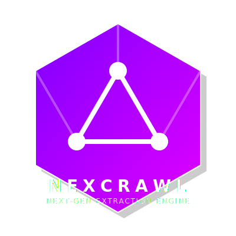

<p align="center">
  
</p>

<h1 align="center">NexCrawl</h1>

<p align="center">
  <strong>The Ultimate Intelligence-Driven Web & App Extraction Framework</strong>
</p>

<p align="center">
  <a href="https://nodejs.org/"></a>
  <a href="LICENSE"></a>
  <a href="https://github.com/Lyx3314844-03/nexcrawl"></a>
</p>

---

## 🚀 Overview

NexCrawl is an industrial-grade crawling and reverse engineering platform designed for high-stakes data acquisition. It combines state-of-the-art AI reasoning with a military-grade stealth layer to bypass the most advanced anti-bot systems on the web and in mobile apps.

## 🛠️ Complete Capability Map

### 1. Multi-Dimensional Engines
*   **HttpCrawler**: High-concurrency engine with custom JA3/JA4/TLS fingerprinting.
*   **BrowserCrawler**: Full-render engine handling Shadow DOM, Canvas, and complex SPA via Playwright/Patchright.
*   **MobileCrawler (Native)**: Direct control of Android/iOS devices via Appium, bypassing mobile-specific WAFs.
*   **GrpcCrawler**: Native gRPC/Protobuf support with zero-config schema inference.
*   **TorCrawler**: Seamless integration with the Tor network for total anonymity.

### 2. AI & Intelligence Layer
*   **AI Extractor**: Extract structured data (JSON) using natural language schemas—**No XPath/CSS required**.
*   **AI Task Agent**: Goal-driven autonomous interaction. Tell it to "Find the cheapest flight," and it decides where to click.
*   **MFA Automator**: Automated bypass for SMS and Email multi-factor authentication.

### 3. Ghost Stealth Layer
*   **VStealth**: Deep environment masking that sanitizes `Error.stack` and emulates real OS-level properties.
*   **Hardware Noise**: Dynamic injection of non-visual noise into WebGL, AudioContext, and Canvas.
*   **WAF Bypass**: Pre-built solvers for Cloudflare (5s shield), Akamai, DataDome, and PerimeterX.

### 4. Advanced Reverse Engineering
*   **V8 Bytecode Analysis**: Framework for analyzing and de-optimizing `.jsc` files.
*   **Memory Forensics**: Automated extraction of encryption keys and sessions directly from process RAM.
*   **Frida Bridge**: Native SSL Pinning bypass for mobile application traffic interception.

### 5. High-Scale Infrastructure
*   **Distributed Sharding**: Redis-based task partitioning for billion-scale URL frontiers.
*   **Self-Healing Pool**: Real-time browser health monitoring and automated zombie process recovery.
*   **Sharded DB Sinks**: Optimized SQL storage with automated horizontal table partitioning.

---

## 💻 Installation Guide

### **Windows**
1.  **Install Node.js**: Download and install [Node.js v20+](https://nodejs.org/).
2.  **Dependencies**: Open PowerShell as Admin and run:
    ```bash
    npm install -g nexcrawl
    # For Mobile automation (Optional)
    npm install -g appium
    ```
3.  **Drivers**: Install Playwright browsers:
    ```bash
    npx playwright install chromium
    ```

### **macOS**
1.  **Install Homebrew**: (If not installed) `/bin/bash -c "$(curl -fsSL https://raw.githubusercontent.com/Homebrew/install/HEAD/install.sh)"`
2.  **Install Node.js**: `brew install node`
3.  **NexCrawl**:
    ```bash
    npm install nexcrawl
    ```
4.  **Special Note**: For MobileCrawler, ensure Xcode and Command Line Tools are installed.

### **Linux (Ubuntu/Debian)**
1.  **Update System**:
    ```bash
    sudo apt-get update
    sudo apt-get install -y nodejs npm ffmpeg libnss3 libatk-bridge2.0-0
    ```
2.  **NexCrawl**:
    ```bash
    npm install nexcrawl
    ```
3.  **Tor Integration**:
    ```bash
    sudo apt-get install tor
    sudo service tor start
    ```

---

## 📖 Quick Start

```javascript
import { NexCrawler, AiExtractor } from 'nexcrawl';

const crawler = new NexCrawler();
const extractor = new AiExtractor();

const html = await crawler.fetch('https://example.com');
const data = await extractor.extract(html, {
  title: "string",
  items: [{ name: "string", price: "number" }]
});

console.log(data);
```

---

## 📜 License
Licensed under the [MIT License](LICENSE).

## 🌍 GitHub
Source Code: [https://github.com/Lyx3314844-03/nexcrawl](https://github.com/Lyx3314844-03/nexcrawl)
