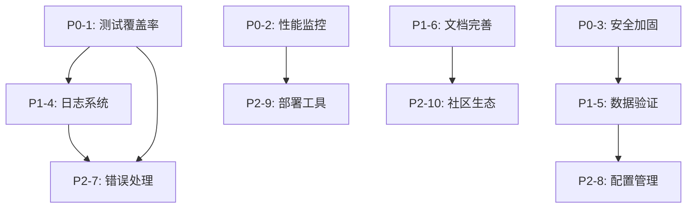

# OmniCrawl 问题优先级矩阵

## 📊 问题分布

### 按优先级分布
```
P0 (Critical)    ████████████████████ 3 个问题 (30%)
P1 (High)        ████████████████████ 3 个问题 (30%)
P2 (Medium)      ████████████████████ 4 个问题 (40%)
```

### 按类别分布
```
质量保证 ████████████ 2 个问题 (20%)
性能监控 ██████ 1 个问题 (10%)
安全性   ██████ 1 个问题 (10%)
可维护性 ████████████████████ 3 个问题 (30%)
运维部署 ████████████ 2 个问题 (20%)
社区生态 ██████ 1 个问题 (10%)
```

## 🎯 优先级矩阵

```
影响程度
  ↑
高│ P0-1 测试覆盖率  │ P0-2 性能监控    │ P1-4 日志系统
  │ P0-3 安全加固    │ P1-5 数据验证    │
  │                  │                  │
中│ P1-6 文档完善    │ P2-7 错误处理    │ P2-8 配置管理
  │                  │                  │
  │                  │                  │
低│ P2-9 部署工具    │ P2-10 社区生态   │
  │                  │                  │
  └──────────────────┴──────────────────┴──────────────→
     低              中                高
                  紧急程度
```

## 📋 问题详情表

| ID | 问题 | 优先级 | 影响 | 紧急度 | 工作量 | 状态 |
|----|------|--------|------|--------|--------|------|
| P0-1 | 测试覆盖率不足 | P0 | 高 | 高 | 5-7天 | ⏳ 待处理 |
| P0-2 | 缺少性能监控 | P0 | 高 | 中 | 2-3天 | ⏳ 待处理 |
| P0-3 | 安全加固不足 | P0 | 高 | 中 | 1-2天 | ⏳ 待处理 |
| P1-4 | 日志系统简单 | P1 | 高 | 低 | 2-3天 | 📅 计划中 |
| P1-5 | 数据验证不完整 | P1 | 中 | 中 | 2-3天 | 📅 计划中 |
| P1-6 | 文档不完整 | P1 | 中 | 低 | 3-5天 | 📅 计划中 |
| P2-7 | 错误处理不一致 | P2 | 中 | 低 | 2-3天 | 📋 待规划 |
| P2-8 | 配置管理不灵活 | P2 | 中 | 低 | 2-3天 | 📋 待规划 |
| P2-9 | 部署工具不足 | P2 | 低 | 低 | 3-5天 | 📋 待规划 |
| P2-10 | 社区生态薄弱 | P2 | 低 | 低 | 持续 | 📋 待规划 |

## 🎯 问题依赖关系



## 📈 改进时间线

```
Week 1-2 (P0)
├── Day 1-7:  测试覆盖率提升 (P0-1)
├── Day 8-10: 性能监控实现 (P0-2)
└── Day 11-12: 安全加固 (P0-3)

Week 3-4 (P1)
├── Day 13-15: 日志系统升级 (P1-4)
├── Day 16-18: 数据验证完善 (P1-5)
└── Day 19-23: 文档补全 (P1-6)

Week 5-8 (P2)
├── Week 5: 错误处理统一 (P2-7)
├── Week 6: 配置管理增强 (P2-8)
├── Week 7: 部署工具完善 (P2-9)
└── Week 8: 社区建设启动 (P2-10)
```

## 💰 投资回报分析

### P0 问题（立即执行）
| 问题 | 投入 | 回报 | ROI |
|------|------|------|-----|
| 测试覆盖率 | 5-7天 | 代码质量↑↑↑, 重构风险↓↓↓ | ⭐⭐⭐⭐⭐ |
| 性能监控 | 2-3天 | 生产可见性↑↑↑, 问题定位↑↑ | ⭐⭐⭐⭐⭐ |
| 安全加固 | 1-2天 | 安全风险↓↓↓, 合规性↑↑ | ⭐⭐⭐⭐⭐ |

### P1 问题（短期改进）
| 问题 | 投入 | 回报 | ROI |
|------|------|------|-----|
| 日志系统 | 2-3天 | 调试效率↑↑, 问题追踪↑↑ | ⭐⭐⭐⭐ |
| 数据验证 | 2-3天 | 用户体验↑↑, 错误减少↑↑ | ⭐⭐⭐⭐ |
| 文档完善 | 3-5天 | 用户上手↑↑↑, 社区参与↑ | ⭐⭐⭐⭐ |

### P2 问题（中期改进）
| 问题 | 投入 | 回报 | ROI |
|------|------|------|-----|
| 错误处理 | 2-3天 | 用户体验↑, 调试效率↑ | ⭐⭐⭐ |
| 配置管理 | 2-3天 | 部署效率↑, 灵活性↑ | ⭐⭐⭐ |
| 部署工具 | 3-5天 | 运维效率↑↑, 可用性↑ | ⭐⭐⭐ |
| 社区生态 | 持续 | 生态发展↑↑, 用户增长↑ | ⭐⭐⭐ |

## 🎯 关键成功因素

### 必须做到（Must Have）
- ✅ 测试覆盖率 ≥ 60%
- ✅ Prometheus metrics 导出
- ✅ 依赖漏洞扫描
- ✅ API Rate Limiting

### 应该做到（Should Have）
- ⏳ 结构化日志（pino）
- ⏳ JSON Schema 验证
- ⏳ API 文档生成
- ⏳ 故障排查手册

### 可以做到（Could Have）
- 📋 全局错误处理
- 📋 配置热更新
- 📋 K8s manifests
- 📋 贡献指南

### 暂不做（Won't Have）
- ❌ 完整的 UI 管理界面
- ❌ 多语言支持（i18n）
- ❌ 插件市场
- ❌ 商业版功能

## 📊 风险评估

### 高风险（需要立即处理）
- 🔴 **测试覆盖率低** - 可能导致生产事故
- 🔴 **无性能监控** - 无法及时发现问题
- 🔴 **安全漏洞** - 可能被攻击

### 中风险（需要短期处理）
- 🟡 **日志系统简单** - 调试困难
- 🟡 **数据验证不足** - 用户体验差
- 🟡 **文档不完整** - 上手困难

### 低风险（可以中期处理）
- 🟢 **错误处理不一致** - 影响有限
- 🟢 **配置管理不灵活** - 可以手动处理
- 🟢 **部署工具不足** - 有替代方案
- 🟢 **社区生态薄弱** - 长期问题

## 🎓 经验教训

### 做得好的地方
- ✅ 功能丰富，覆盖面广
- ✅ 代码结构清晰
- ✅ 有基础的测试和文档
- ✅ 有 CI/CD 流程

### 需要改进的地方
- ⚠️ 测试覆盖率不足
- ⚠️ 缺少生产级监控
- ⚠️ 安全措施不够
- ⚠️ 文档不够完善

### 未来建议
- 💡 测试驱动开发（TDD）
- 💡 持续集成测试覆盖率
- 💡 定期安全审计
- 💡 文档先行原则

## 📞 联系方式

如有问题或建议，请：
1. 查看 [PROJECT_GAPS_ANALYSIS.md](./PROJECT_GAPS_ANALYSIS.md)
2. 参考 [QUICK_ACTION_PLAN.md](./QUICK_ACTION_PLAN.md)
3. 提交 GitHub Issue
4. 联系维护者

---

**最后更新**: 2026-04-18  
**下次审查**: 2026-05-18（1 个月后）
